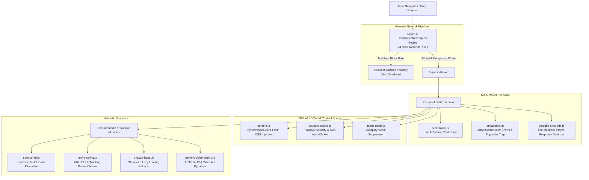

<div align="center">


# Super AD Blocker

**A high-performance, next-generation Manifest V3 ad and privacy blocker for Chromium browsers.**

<p align="center">
  Developed & Maintained by <strong><a href="https://github.com/arunkumarjust97-arch">Arun Kumar</a></strong>
</p>

[](manifest.json)
[](manifest.json)
[](https://github.com/arunkumarjust97-arch)
[](manifest.json)
[](https://github.com/arunkumarjust97-arch/Super-Blocker)
[](#privacy--security-guarantee)

<p align="center">
  <a href="#key-features">Key Features</a> •
  <a href="#defense-in-depth-architecture">Architecture</a> •
  <a href="#ruleset-breakdown">Rulesets</a> •
  <a href="#content-engines--scripts">Engines</a> •
  <a href="#installation">Installation</a> •
  <a href="#options--controls">Options & Controls</a> •
  <a href="#author--maintainer">Author</a> •
  <a href="#changelog">Changelog</a>
</p>

---

</div>

## Overview

**Super AD Blocker** is an ultra-fast, robust, privacy-focused browser extension architected specifically for Google Chrome's **Manifest V3 (MV3)** platform. 

Instead of relying solely on heavy runtime DOM manipulation or fragile basic domain lists, Super AD Blocker deploys a **defense-in-depth engine** combining:
- **24,600+ network rules** evaluated natively via Chrome's C++ `declarativeNetRequest` engine for near-zero CPU overhead.
- **Dual-stage YouTube ad neutralization** that eliminates ad placements at the player-response source before playback begins.
- **Zero-flash cosmetic styling** injected at `document_start` with word-boundary selector matching.
- **Intelligent heuristic engines** for anti-adblock detection bypass, unsolicited push-notification suppression, multilingual sponsored post hiding, query tracking parameter stripping, and resource-saving off-screen lazy loading.

---

## Key Features

<table>
  <tr>
    <td width="50%">
      <h3>🛡️ 24,600+ Native DNR Rules</h3>
      <p>Multi-tiered network filtering powered by <b>EasyList</b>, <b>EasyPrivacy</b>, and <b>HaGeZi Multi PRO</b>. Blocks ads, tracking pixels, telemetry, scam nodes, and cryptojacking at wire speed.</p>
    </td>
    <td width="50%">
      <h3>▶️ YouTube Source Ad Stripping</h3>
      <p>Intercepts YouTube player responses in the page context before the player reads them, safely emptying ad-scheduling slots without black screens, audio glitches, or buffer hangs.</p>
    </td>
  </tr>
  <tr>
    <td width="50%">
      <h3>🔕 Anti-Adblock & Popunder Bypass</h3>
      <p>Emulates standard advertising objects (<code>adsbygoogle</code>, <code>canRunAds</code>) and neutralizes detection libraries (<code>BlockAdBlock</code>, <code>FuckAdBlock</code>). Restricts popunders to genuine user gestures.</p>
    </td>
    <td width="50%">
      <h3>🚫 Push Notification Spam Shield</h3>
      <p>Silently rejects intrusive <code>Notification.requestPermission()</code> and <code>PushManager.subscribe()</code> prompts triggered on page load or scroll, while preserving legitimate user-initiated actions.</p>
    </td>
  </tr>
  <tr>
    <td width="50%">
      <h3>🍪 Cookie & Annoyance Annihilation</h3>
      <p>Instantly suppresses GDPR/cookie consent popups, newsletter banners, exit-intent lightboxes, and Taboola/Outbrain chumbox clickbait widgets.</p>
    </td>
    <td width="50%">
      <h3>🔎 Multilingual Sponsored Post Purge</h3>
      <p>Dynamically scans and collapses sponsored cards and promoted feed items across Reddit, X (Twitter), Amazon, Google, and Bing, even when class names are obfuscated.</p>
    </td>
  </tr>
  <tr>
    <td width="50%">
      <h3>🔗 Tracking Parameter Stripper</h3>
      <p>Automatically cleans URL parameters (<code>fbclid</code>, <code>gclid</code>, <code>utm_*</code>, <code>msclkid</code>, <code>twclid</code>, etc.) from the active address bar and outgoing hyperlinks in real time.</p>
    </td>
    <td width="50%">
      <h3>⚡ Browse Faster & Focus Mode</h3>
      <p>Enforces native lazy-loading on off-screen media, stops uninvited video autoplay on news/editorial pages, and conserves memory and CPU cycles.</p>
    </td>
  </tr>
</table>

---

## Defense-in-Depth Architecture

Super AD Blocker orchestrates multiple browser subsystems to ensure maximum ad and tracker suppression with zero site breakage.



---

## Ruleset Breakdown

Super AD Blocker distributes its filtering definitions across **7 dedicated DeclarativeNetRequest rulesets** (`manifest.json`), maintaining full compliance with Chrome's per-extension static rule budget.

| Ruleset File | Rules | Type | Primary Function |
|:---|:---:|:---:|:---|
| [`hagezi-rules.json`](file:///f:/Extensions/AD-Blocker/AD-Blocker/hagezi-rules.json) | **20,000** | Static DNR | Core subset derived from **HaGeZi's Multi PRO** blocklist: ads, tracking servers, telemetry endpoints, malicious domains, and cryptominers. |
| [`easylist-rules.json`](file:///f:/Extensions/AD-Blocker/AD-Blocker/easylist-rules.json) | **4,310** | Static DNR | Curated network rules extracted from **EasyList** and **EasyPrivacy** for global ad/tracking network coverage. |
| [`rules.json`](file:///f:/Extensions/AD-Blocker/AD-Blocker/rules.json) | **137** | Static DNR | Hand-crafted rules targeting top ad networks, video ad SDK endpoints, tracking beacons, and popunder routing services. |
| [`annoyance-rules.json`](file:///f:/Extensions/AD-Blocker/AD-Blocker/annoyance-rules.json) | **65** | Static DNR | Blocks remote scripts and resources for cookie consent managers (OneTrust, Cookiebot) and native chumboxes (Taboola, Outbrain). |
| [`tracker-rules.json`](file:///f:/Extensions/AD-Blocker/AD-Blocker/tracker-rules.json) | **30** | Static DNR | Blocks cross-site ad measurement beacons, conversion tracking pixels, and device fingerprinting scripts. |
| [`performance-rules.json`](file:///f:/Extensions/AD-Blocker/AD-Blocker/performance-rules.json) | **30** | Static DNR | Targets resource-draining live-chat widgets and third-party session recorders (Hotjar, FullStory, Smartlook). |
| [`allowlist-rules.json`](file:///f:/Extensions/AD-Blocker/AD-Blocker/allowlist-rules.json) | **32** | Static DNR Exception | Curated allowlist ensuring essential infrastructure (Google Fonts, Stripe, PayPal, reCAPTCHA, GitHub CDN, Slack, Zoom) operates flawlessly. |

> [!NOTE]
> **Total Static Rules:** **24,604**. Chrome guarantees a minimum quota of **30,000** rules per extension under Manifest V3. Super AD Blocker stays comfortably within this threshold, leaving room for dynamic per-site exceptions.

---

## Content Engines & Scripts

```
f:/Extensions/AD-Blocker/AD-Blocker/
├── antiadblock.js            # Page-world detector stubbing & popunder filter
├── anti-tracking.js          # Real-time URL query parameter stripping
├── background.js             # Service worker: DNR sync, dynamic rules, stats
├── browse-faster.js          # Viewport-aware lazy loading for media
├── content.js                # Instant zero-flash cosmetic stylesheet & observer
├── focus-mode.js             # Unsolicited video autoplay suppression
├── generic-video-adskip.js   # IMA SDK and generic HTML5 video ad skipper
├── push-block.js             # Smart user-activation push spam barrier
├── sponsored.js              # Semantic multilingual feed card remover
├── youtube-adskip.js         # Fallback YouTube ad skipper & speed adjuster
└── youtube-strip-ads.js      # Raw player response ad payload sanitizer
```

### Detailed Script Capabilities

#### 1. [`youtube-strip-ads.js`](file:///f:/Extensions/AD-Blocker/AD-Blocker/youtube-strip-ads.js)
- **Target:** `*://*.youtube.com/*`, `*://*.youtube-nocookie.com/*`, `*://*.youtubekids.com/*`
- **Execution Context:** `MAIN` world at `document_start`
- **Operation:** Hooks `JSON.parse` and network responses to strip ad parameters (`playerAds`, `adPlacements`, `adSlots`, `adBreakParams`, `instreamAdPlayerResponse`, etc.) before the player state initializes.
- **Safety Guarantee:** Preserves `streamingData`, `adaptiveFormats`, and audio formats to eliminate buffering or playback failure.

#### 2. [`antiadblock.js`](file:///f:/Extensions/AD-Blocker/AD-Blocker/antiadblock.js)
- **Target:** All URLs (`<all_urls>`)
- **Execution Context:** `MAIN` world at `document_start`
- **Operation:** Defines mock objects for `adsbygoogle`, sets `canRunAds = true`, and stubs detection packages such as `BlockAdBlock`, `FuckAdBlock`, `sniffAdBlock`, and `adblockDetector`. Intercepts `window.open` to suppress unauthorized background popunders.

#### 3. [`push-block.js`](file:///f:/Extensions/AD-Blocker/AD-Blocker/push-block.js)
- **Target:** All URLs (`<all_urls>`)
- **Execution Context:** `MAIN` world at `document_start`
- **Operation:** Proxies `Notification.requestPermission()` and `PushManager.prototype.subscribe()`. Inspects `navigator.userActivation.isActive`. Automatically rejects uninvited permission prompts while permitting legitimate clicks.

#### 4. [`content.js`](file:///f:/Extensions/AD-Blocker/AD-Blocker/content.js)
- **Target:** All URLs (`<all_urls>`)
- **Execution Context:** Isolated world at `document_start`
- **Operation:** Immediately injects a master CSS stylesheet before page rendering to eliminate ad flash. Employs word-boundary selectors (`tok()`) to prevent false positives (e.g. `thread-container`). Uses an optimized, debounced `MutationObserver` for dynamically inserted ad elements.

#### 5. [`sponsored.js`](file:///f:/Extensions/AD-Blocker/AD-Blocker/sponsored.js)
- **Target:** All URLs except YouTube
- **Execution Context:** Isolated world at `document_idle`
- **Operation:** Traverses DOM leaf nodes to identify multilingual sponsored tags (*Sponsored*, *Promoted*, *Anzeige*, *Gesponsert*, *Patrocinado*, *Publicidad*, *प्रायोजित*, etc.) and hides the parent card structure.

#### 6. [`anti-tracking.js`](file:///f:/Extensions/AD-Blocker/AD-Blocker/anti-tracking.js)
- **Target:** All URLs (`<all_urls>`)
- **Execution Context:** Isolated world at `document_idle`
- **Operation:** Strips tracking markers (`fbclid`, `gclid`, `gclsrc`, `dclid`, `msclkid`, `twclid`, `ttclid`, `yclid`, `utm_*`, etc.) using `history.replaceState` for clean address bars and link sanitization.

#### 7. [`browse-faster.js`](file:///f:/Extensions/AD-Blocker/AD-Blocker/browse-faster.js)
- **Target:** All URLs (`<all_urls>`)
- **Execution Context:** Isolated world at `document_idle`
- **Operation:** Dynamically assigns `loading="lazy"` to offscreen `` and `<iframe>` elements and `preload="none"` to offscreen `<video>` elements to reduce memory usage and accelerate load times.

#### 8. [`focus-mode.js`](file:///f:/Extensions/AD-Blocker/AD-Blocker/focus-mode.js)
- **Target:** All URLs except YouTube
- **Execution Context:** Isolated world at `document_start`
- **Operation:** Pauses uninvited autoplay videos and removes the `autoplay` attribute before the user interacts, leaving primary media players untouched upon explicit click.

---

## Installation

Works seamlessly with any modern Chromium-based web browser: **Google Chrome**, **Microsoft Edge**, **Brave**, **Opera**, **Vivaldi**, and **Arc**.

### Step-by-Step Setup

```
1. Download or clone this repository to your computer.
2. Open your Chromium browser and navigate to the Extensions management page:
   • Chrome:  chrome://extensions
   • Edge:    edge://extensions
   • Brave:   brave://extensions
3. Enable "Developer mode" via the toggle switch in the top-right corner.
4. Click the "Load unpacked" button in the upper-left toolbar.
5. Select the project directory:
   f:/Extensions/AD-Blocker/AD-Blocker
6. Pin "Super AD Blocker" to your browser toolbar for instant access.
```

> [!TIP]
> **Updating:** When pulling new changes, click the **Reload (↻)** icon on the Super AD Blocker extension card in `chrome://extensions`, then refresh any active browser tabs.

---

## Options & Controls

### Extension Popup (`popup.html`)
Click the toolbar icon to view:
- **Per-Site Protection Toggle:** One-click disable/enable for the current website (automatically adds dynamic DNR allow rules and reloads the page).
- **Blocked Counter:** Live tally of network-level and cosmetic ad and tracker blocks.
- **Hide Cookie Alerts:** Quick toggle for cookie banner suppression.
- **Settings Shortcut:** Direct link to the full options dashboard.

### Options Dashboard (`options.html`)
Access advanced controls by clicking the **⚙ Settings** icon:
- **Master Kill Switch:** Instantly enable or disable all blocking across the entire browser.
- **Granular Toggles:**
  - *Hide cookie-consent banners* (Removes GDPR/ePrivacy dialogs)
  - *Focus Mode* (Stops uninvited video autoplay)
  - *Block Trackers* (Toggles tracking ruleset & parameter cleaning)
  - *Browse Faster* (Toggles offscreen media lazy loading)
- **Site Exceptions Manager:** Add, review, or remove domain-level allowlist rules.
- **Data Management:**
  - **Export Settings:** Download your configuration and site exceptions as a `.json` backup file.
  - **Import Settings:** Restore your settings on any workstation.
  - **Clear All Data:** Reset counters and options to factory defaults.

---

## Technical Specifications

| Parameter | Specification | Details |
|:---|:---|:---|
| **Manifest Version** | `3` | Fully compatible with modern Chromium specifications. |
| **Permissions** | `declarativeNetRequest`, `declarativeNetRequestFeedback`, `storage`, `activeTab` | Minimal footprint; no arbitrary remote code execution. |
| **Host Permissions** | `<all_urls>` | Required for DNR dynamic exception injection and cosmetic script injection. |
| **Background Mode** | `Service Worker` (`background.js`) | Ephemeral background execution; zero memory overhead when idle. |
| **Script Execution** | Dual-World (`MAIN` & `ISOLATED`) | Unlocks deep API shimming without compromising extension isolation. |

---

## Developer Debugging Switches

For advanced diagnostics or troubleshooting edge cases on YouTube, open the **DevTools Console (`F12`)** on `youtube.com`:

```javascript
// Temporarily bypass YouTube player-response stripping:
localStorage.setItem("sab_yt_off", "1");

// Enable experimental server-side ad config (SSAP) stripping:
localStorage.setItem("sab_yt_ssap", "1");

// Reset flags back to default:
localStorage.removeItem("sab_yt_off");
localStorage.removeItem("sab_yt_ssap");
```

---

## Privacy & Security Guarantee

Super AD Blocker is committed to complete user privacy:

- **100% Client-Side:** Every rule evaluation and script execution happens locally on your machine.
- **Zero Telemetry:** No analytics, tracking tokens, telemetry pings, or background data collection.
- **No Remote Code:** All scripts, stylesheets, and JSON rulesets are packaged locally inside the extension.
- **Open Codebase:** Clean, readable, unminified JavaScript for full auditability.

---

## Changelog

### Version 3.2.0
- **Push Notification Suppression (`push-block.js`):** Intercepts `Notification.requestPermission` and `PushManager.subscribe`. Silently denies automated prompts while preserving user clicks.
- **Multilingual Sponsored Post Removal (`sponsored.js`):** Intelligently detects and collapses promoted cards across Reddit, X, Amazon, Google, and Bing without breaking page layout.
- **Expanded Tracker Ruleset:** Added dedicated ruleset targeting tracking parameters and analytical pixels.

### Version 3.1.2
- **Zero-Flash Cosmetic Injection:** Stylesheets now inject synchronously at `document_start` to eliminate ad flicker.
- **Word-Boundary Selector Hardening:** Fixed false positives where substring matching inadvertently hid legitimate elements (e.g. `thread-container`, `download-container`).
- **Debounced DOM Mutation:** Optimized `MutationObserver` routines to reduce page reflows during heavy DOM updates.

---

## Author & Maintainer

<p align="left">
  <strong>Arun Kumar</strong><br/>
  Creator & Lead Developer of Super AD Blocker
</p>

- 🐙 **GitHub:** [@arunkumarjust97-arch](https://github.com/arunkumarjust97-arch)
- 📁 **Repository:** [Super-Blocker](https://github.com/arunkumarjust97-arch/Super-Blocker)
- ✉️ **Contact / Support:** [devteam.official@myyahoo.com](mailto:devteam.official@myyahoo.com)

---

## Support & Contributing

- **Issue Tracker & Repository:** [GitHub Repository](https://github.com/arunkumarjust97-arch/Super-Blocker)
- **Support & Bug Reports:** [devteam.official@myyahoo.com](mailto:devteam.official@myyahoo.com)

Pull requests, rule enhancements, and bug reports are welcome! Please ensure all rule additions adhere to Chrome's `declarativeNetRequest` schema.

---

<div align="center">
  <p>Crafted with ❤️ by <strong><a href="https://github.com/arunkumarjust97-arch">Arun Kumar</a></strong></p>
  <sub>© 2026 Arun Kumar. All rights reserved. Distributed under open collaborative terms.</sub>
</div>
